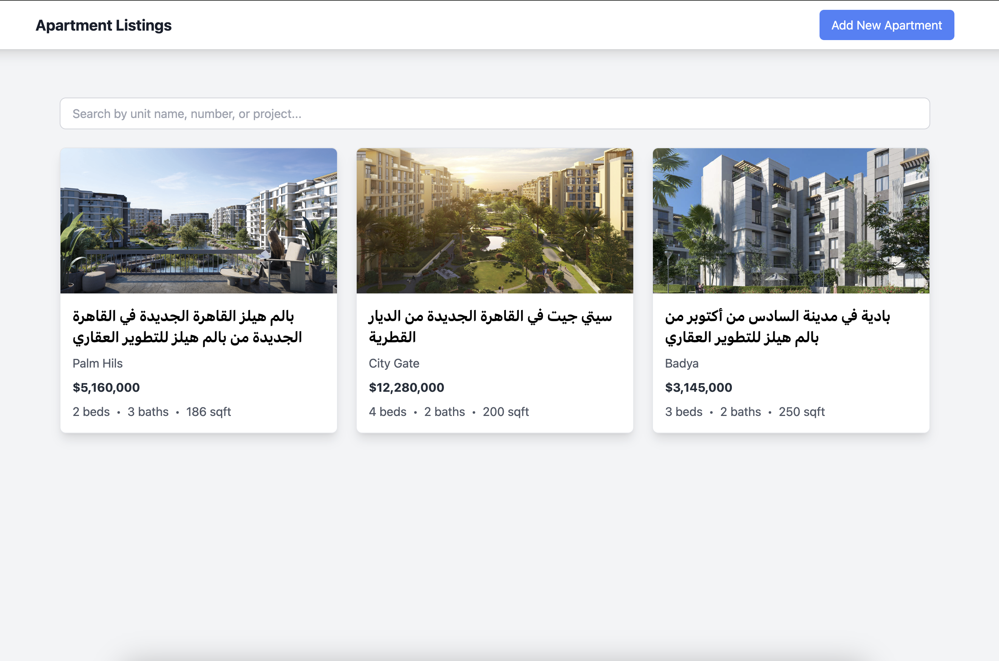
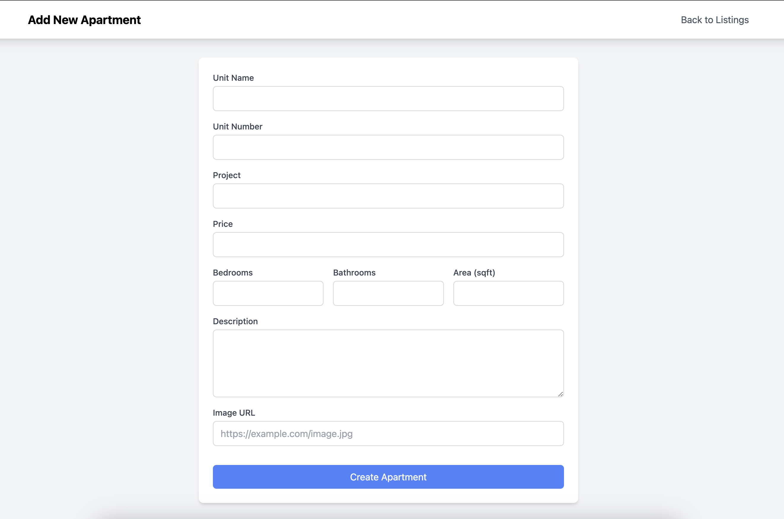
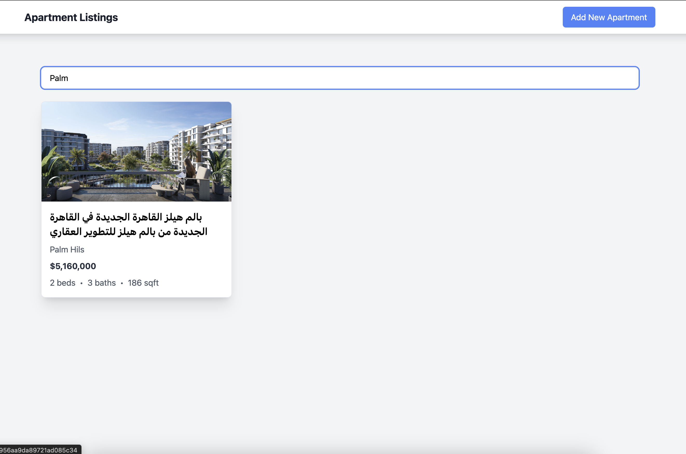
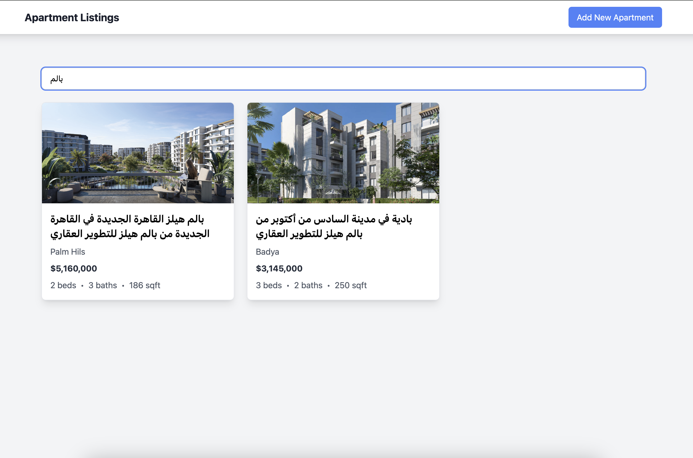
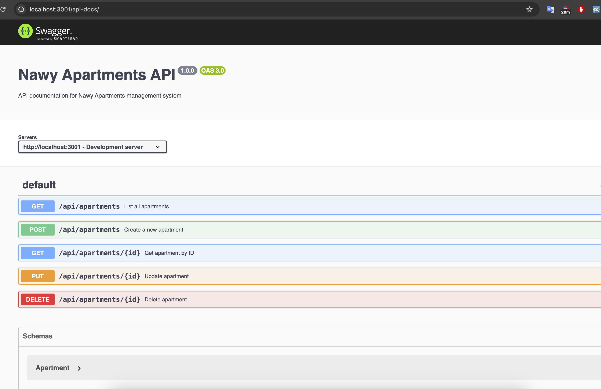

# Nawy Apartments Management System

A full-stack application for managing apartment listings built with Next.js, Express, and MongoDB.

## Features

- 📱 Responsive design
- 🏠 Apartment listings with search functionality
- 📝 Detailed apartment information
- ➕ Create new apartment listings
- 🗑️ Delete apartments
- 📚 API documentation with Swagger

## Screenshots

### Homepage

*Main page showing all apartment listings*

### Apartment Details

*Detailed view of an apartment with all information*

### Create New Apartment

*Form for adding new apartments*

### Search with Project attribute

*Searching with Project attribute*

### Search with Unit Number attribute

*Searching with Unit Number attribute*

### Search with Unit Name attribute

*Searching with Unit Name attribute*

### API Documentation

*Interactive API documentation with Swagger UI*

## Tech Stack

- **Frontend**: Next.js, TypeScript, Tailwind CSS
- **Backend**: Express.js, TypeScript, MongoDB
- **Infrastructure**: Docker, Docker Compose

## Prerequisites

- Docker
- Docker Compose

## Getting Started

1. Clone the repository:
```bash
git clone https://github.com/izanaty9/Nawy-Task.git
cd Nawy-Task
```
2. Start the application:

```bash
docker-compose up --build
```

3. Access the applications:
- Frontend: http://localhost:3000
- Backend API: http://localhost:3001
- API Documentation: http://localhost:3001/api-docs